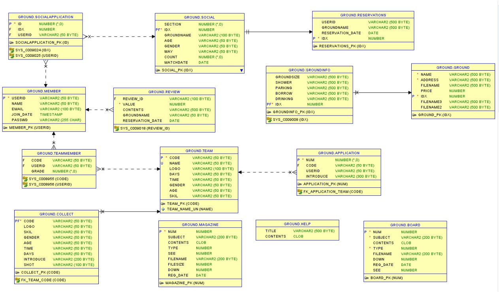

# ⚽ 스포츠 구장 대여 및 소셜 매칭 플랫폼
"함께 즐기는 스포츠의 시작, 구장 예약부터 소셜 매치까지"

## 📌 프로젝트 개요
회원 간의 활발한 스포츠 활동을 지원하기 위해 **구장 예약**과 **소셜 매칭**을 결합한 통합 서비스입니다. 사용자가 직접 구장을 예약하고, 남는 인원을 소셜 매치를 통해 모집하여 커뮤니티를 활성화하는 데 중점을 두었습니다.

## 🛠️ 기술 스택
- **Backend:** Java (JDK 17), Spring Boot, MyBatis
- **Database:** Oracle Database (SQL Developer)
- **Frontend:** HTML5, CSS3, JavaScript (AJAX)
- **Tool:** Git, GitHub

## 📊 서비스 구조 (ERD)

*회원(Member)을 중심으로 예약(Reservations), 매칭(Social), 팀(Team), 커뮤니티(Board/Magazine)가 유기적으로 연결된 데이터 모델링을 설계했습니다.*

---

## 🚀 주요 기능 및 시연

### 1. 직관적인 구장 예약 시스템
- **지역별 필터링:** 지역/시설별로 구장을 분류하여 사용자 편의성 제공.
- **예약 로직:** 현재 시간이 예약 시간을 초과할 경우 버튼을 자동 비활성화하여 데이터의 유효성을 보장합니다.
- **가격 연동:** 실시간으로 선택된 구장의 가격이 합산/차감되는 동적 UI 구현.
- [구장 예약 시연 영상 링크]

### 2. 소셜 매칭 (Social Match)
- **예약 데이터 기반 등록:** 예약이 확정된 내역만을 조회하여 매칭 등록 가능.
- **모달 기반 UI:** 페이지 이동 없는 매칭 모집글 작성(나이, 성별, 모집 인원 등).
- [소셜 매칭 시연 영상 링크]

### 3. 사용자 중심 커뮤니티
- 자유게시판, 공지사항, 매거진 기능을 통해 스포츠 정보 공유 및 소통 창구 제공.

---

## 💡 트러블슈팅 및 기술적 고민

### 1. 데이터 영속성 및 무결성 관리
- **[문제 상황]** 부모 엔티티(구장) 삭제 시 연관된 자식 데이터(예약, 경기)가 남거나 삭제되지 않아 참조 무결성 오류가 발생했습니다.
- **[해결 과정]** DB 제약 조건인 `ON DELETE CASCADE`를 적절히 활용하여 데이터 생명주기를 설계했습니다. 
- **[배운 점]** 단순히 데이터를 저장하는 것을 넘어, 데이터의 일관성을 유지하는 것이 서비스 시스템의 안정성에 직결됨을 깊이 있게 체득했습니다.

---

## 📺 시연 영상 (GIF)

*지역 별로 구장을 분류했습니다. 구장 사진을 클릭하면 모달로 그 구장의 다른 사진이 나오게 구현하였습니다.
현재시간이 예약시간보다 지나버리면 예약하는 버튼을 비활성화하였습니다. 클릭 시 그 구장의 가격이 추가가 되며 클릭 해제 시 구장 가격이 감소하게 됩니다. 구장마다 구장 크기, 샤워, 주차 여부, 신발 대여, 음료 판매 등 구장의 특징을 구장 정보 섹터에 구현했습니다.*

*사용자가 예약한 내역을 데이터베이스에서 조회하여 리스트로 보여줍니다.
예약 완료 상태인 데이터만 추출하여 '소셜 매치 등록' 버튼이 활성화되도록 구현했습니다.
페이지 이동 없이 팝업창(모달)에서 나이, 성별, 모집 인원 등 세부 조건을 입력받습니다.
등록된 매칭은 소셜 매치 메인 페이지에 즉시 노출됩니다.*
---

## 🔗 관련 문서
- [자세한 프로젝트 포트폴리오 (Notion)](https://app.notion.com/p/4969c0ef6065420f8de8b2683df40c4e?p=3232dda151ec80fab9d5d63b2f13f13d&pm=c)

---
*본 프로젝트는 실무적인 서비스 운영을 고려하여 데이터 무결성과 사용자 경험(UX)을 최우선으로 설계되었습니다.*
